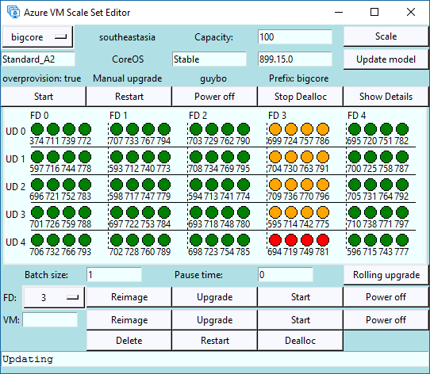
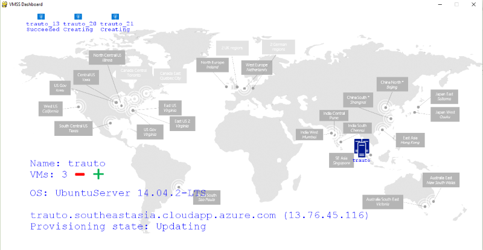

# VMSS Dashboard tools

Simple Python tools to demonstrate Azure [Virtual Machine Scale Sets](https://azure.microsoft.com/en-us/services/virtual-machine-scale-sets/) by calling the Azure Compute REST API.

## VMSS Editor
GUI editor to view and manage Azure VM Scale Sets. 

VMSS Editor is a Python/Tkinter script to manage VM Scale Sets. You can use it to:
- View VM Scale Set properties and status.
- Manually scale a VM Scale Set in or out.
- Upgrade the version of a platform image, or upgrade a custom image.
- Vertically scale - increase of decrease VMs size and roll it out across the set.
- Perform a rolling upgrade of image or VM size across scale set
- Start/Restart/Power off/Stop dealloc a scale set.
- View scale set VMs in a heat map showing fault domains and update domains.
- Operate on fault domains: Upgrade/Reimage/Start/Power off.
- Operate on individual VMs: Upgrade/Reimage/Start/Power off/Delete/Restart/Dealloc. 

### Installation
  1. Install Python 3.x.
  2. Install the azurerm REST wrappers for Microsoft Azure: pip install azurerm
  3. Clone or copy this repo. Specifically you need vmsseditor.py, subscription.py, vmss.py, vm.ico and vmssconfig.json.
  4. Register an Azure application, create a service principal and get your tenant id. See "Using vmssdashboard and vmsseditor" below.
  5. Put in values for your application and subscription in vmssconfig.json.
  7. Run: python vmsseditor.py
  
### Using vmssdashboard and vmsseditor

To use these apps (and in general to access Azure Resource Manager from a program without going through 2 factor authentication) you need to register your application with Azure and create a "Service Principal" (an application equivalent of a user). Once you've done this you'll have 3 pieces of information: A tenant ID, an application ID, and an application secret. You will use these to populate the vmssconfig.json file. For more information on how to get this information go here: [Authenticating a service principal with Azure Resource Manager][service-principle]. See also:
[Azure Resource Manager REST calls from Python][python-auth].

[service-principle]: https://azure.microsoft.com/en-us/documentation/articles/resource-group-authenticate-service-principal/ - make sure you create it with at least "Contributor" rights, not "Reader".
[python-auth]: https://msftstack.wordpress.com/2016/01/05/azure-resource-manager-authentication-with-python

### Performing a rolling upgrade

The rolling upgrade feature was added to show how scale set operations like "manualUpgrade" can be combined to form a semi-automated roll-out of VM updates without disrupting application availability.

Here's a 2 minute video demo of the rolling upgrade feature in action..

## VMSS Dashboard
Dashboard to show Azure VM Scale Set status and properties. 

Note: this tool needs a bit more work in order to comfortably scale to more than 10 or so VMs. In particular it needs to display smaller VM icons, and use a more efficient call to get VM instance views. You might want to consider using the more recent VMSS Editor above instead.

Also note: If you like VMSS Dashboards, make sure you also take a look at [ASCii VMSS Dashboard](https://github.com/msleal/asciivmssdashboard) by Marcelo Leal - this is an amazing ASCii based dashboard for monitoring VM Scale Sets, with many more functions than VMSS Dashboard.

### Installation
  1. Install Python 3.x.
  2. Install the azurerm REST wrappers for Microsoft Azure: pip install azurerm
  3. Install [pygame](http://www.pygame.org/download.shtml)
  4. Download the files under [vmssdashboard-old](https://github.com/gbowerman/vmssdashboard/tree/master/vmssdashboard-old).
  5. Register an Azure application, create a service principal and get your tenant id. See "Using vmssdashboard".
  6. Put in values for your application, along with your resource group name, and VM Scale Set name in vmssconfig.json.
  7. Run: python vmssdashboard.py

